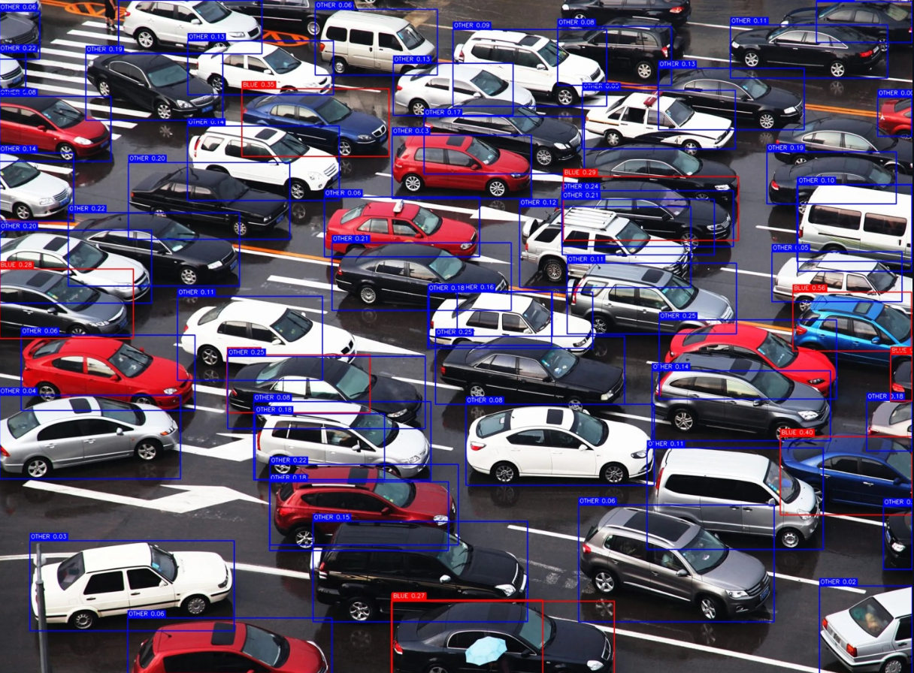

### 🚦 CAR COLOUR DETECTION & PEOPLE COUNTER

A Streamlit-based computer vision application for detecting cars, predicting their colour (blue / not-blue), and counting people in traffic scenes.

##📌 1. Problem Statement

Traffic surveillance is essential for safety, analytics, and traffic management.
This project aims to develop a computer vision system that:

✔ Detects cars at a traffic signal
✔ Predicts the colour of each car

Red box → Blue car

Blue box → Any other colour

✔ Counts the total number of cars
✔ Detects and counts people
✔ Provides a clean, user-friendly GUI to upload images and view annotated results
✔ Uses a trained ML model (best.pt) + custom HSV-based colour detection logic

This project fulfills the internship requirement of building your own car colour detection model along with object counting.

## 📂 2. Dataset

The dataset consists of two parts:

 ##  Vehicle Classification Dataset (for training best.pt)

Custom dataset created manually by collecting images of:

Car

Truck

Organized in:

car_dataset/
    train/
        car/
        truck/
    valid/
        car/
        truck/

Used to train a YOLOv8 classification model → outputs best.pt.

## B. Colour Detection Dataset (Implicit)

Colour classification is not ML-based.
Instead, colour prediction is done using a robust HSV-based pixel analysis, so no labelled colour dataset was required.

## C. Input Images

Used for testing the final model:

Traffic images containing multiple cars

Images containing people

Various lighting conditions

## ⚙️ 3. Methodology

The system is built with the following major components:

## A. Object Detection — YOLOv8

A pretrained YOLOv8 detection model (yolov8n.pt) is used to detect:

Cars

Trucks

Buses

People

Only bounding boxes + class labels are taken from this model.
If YOLO weights are missing locally, Ultralytics automatically downloads them.

## B. Vehicle Type Classification — Trained Model (best.pt)

best.pt  ← MY OWN trained machine learning model

This model identifies:

Car

Truck

The model is included in the project and fully usable.

## C. Car Colour Detection — HSV Algorithm (Custom ML Logic)

Instead of training a colour classifier, a pixel-based HSV analysis is performed inside color_detect.py.

Steps:

Crop the detected car

Convert to HSV

Apply blue mask:

lower_blue = [90, 60, 60]
upper_blue = [130, 255, 255]

Calculate blue pixel ratio

If blue_ratio > threshold → classify as blue car

Threshold is adjustable in the UI:

Default: 0.25

## Benefits:

Very fast

Works without training

Robust to lighting

## D. Annotation Rules
Car Type	Box Colour	Meaning
Blue Car	Red Box	As per requirement
Other Car	Blue Box	All non-blue cars
Person	Yellow Box	Count only

Text added above the box includes:

Class name

Classifier confidence

Blue / Other + blue ratio

## E. Streamlit GUI

The GUI supports:

✔ Image upload (jpg, png, webp)
✔ Preview of uploaded image
✔ Adjustable:

Blue pixel threshold

Detection confidence

## ✔ Displays:

Annotated output

Car count

Blue car count

Other car count

People count

✔ Download annotated image

Clean and internship-ready UI.

## 📊 4. Results

✔ System achieves:

Accurate detection of cars and people using YOLOv8

Reliable blue colour prediction through HSV algorithm

High-speed inference even on CPU

Professional-grade GUI

Correct annotation and counting

